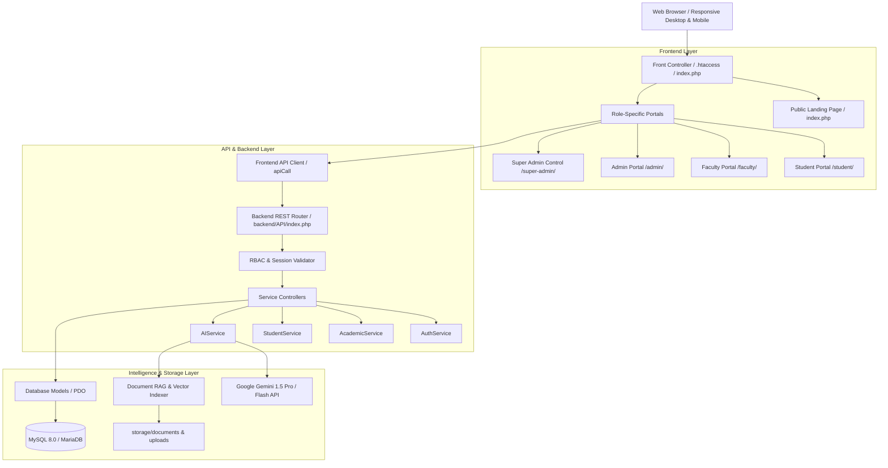

# StudentOS AI — The Intelligent Academic Operating System

<div align="center">


<p align="center">
  <strong>A unified, enterprise-grade academic management ecosystem and productivity operating system powered by Generative AI, RAG document intelligence, and multi-tier institutional governance.</strong>
</p>

[Explore Portals](#-portal-directory--default-credentials) • [Architecture](#-system-architecture) • [Features](#-core-capabilities) • [Installation](#-installation--quick-setup) • [API Blueprint](#-rest-api-blueprint)

</div>

---

## 📋 Table of Contents

- [1. Executive Summary & Vision](#-executive-summary--vision)
- [2. System Architecture](#-system-architecture)
- [3. Four-Tier Institutional RBAC Matrix](#-four-tier-institutional-rbac-matrix)
- [4. Core Capabilities & Feature Breakdown](#-core-capabilities)
  - [4.1. Intelligent AI Engine & RAG Document Intelligence](#41-intelligent-ai-engine--rag-document-intelligence)
  - [4.2. Student Academic & Productivity Portal](#42-student-academic--productivity-portal)
  - [4.3. Faculty Command Center](#43-faculty-command-center)
  - [4.4. University Administration Portal](#44-university-administration-portal)
  - [4.5. Super Administrator Root Control](#45-super-administrator-root-control)
- [5. Portal Directory & Default Credentials](#-portal-directory--default-credentials)
- [6. Installation & Quick Setup](#-installation--quick-setup)
- [7. Environment Configuration (.env)](#-environment-configuration-env)
- [8. REST API Blueprint](#-rest-api-blueprint)
- [9. Database Architecture & Schema](#-database-architecture--schema)
- [10. Security & Threat Mitigation](#-security--threat-mitigation)
- [11. Codebase Directory Tour](#-codebase-directory-tour)
- [12. Troubleshooting & FAQ](#-troubleshooting--faq)
- [13. Contributing & License](#-contributing--license)

---

## 🌟 Executive Summary & Vision

Traditional university software stacks suffer from severe fragmentation: attendance is maintained in local spreadsheets, assignment submissions are scattered across disparate drives, communication happens through unmonitored messaging groups, and students lack centralized study tools.

**StudentOS AI** unifies the entire academic lifecycle into a cohesive, high-performance operating system designed with modern SaaS software patterns:

```text
┌──────────────────────────────────────────────────────────────────────────┐
│                             StudentOS AI                                 │
├───────────────────┬────────────────────┬─────────────────────────────────┤
│ Academic Engine   │ Productivity Suite │ AI Intelligence Engine          │
│ • Courses & Syllabi│ • Tasks & Kanban   │ • Google Gemini 1.5 Integration │
│ • Attendance      │ • Notes & Markdown │ • RAG Document Vector Search    │
│ • Exams & Grading │ • Study Sessions   │ • Automated Quiz Generation     │
│ • Timetables      │ • Goals & Milestones│• Personalized Study Roadmaps   │
└───────────────────┴────────────────────┴─────────────────────────────────┘
```

---

## 🏗 System Architecture

The platform uses a layered **Service-Repository OOP Architecture** paired with a unified REST API layer, preventing tight coupling and ensuring maintainability.



---

## 👥 Four-Tier Institutional RBAC Matrix

StudentOS AI utilizes centralized role-based access control with granular permission checks enforced at both the UI component layer and API endpoints:

```text
                           ┌─────────────────────────┐
                           │   SUPER ADMINISTRATOR   │
                           │     (Role ID: 1)        │
                           └────────────┬────────────┘
                                        │ Full System Root & Audit
                  ┌─────────────────────┴─────────────────────┐
                  ▼                                           ▼
       ┌────────────────────┐                       ┌───────────────────┐
       │     UNIVERSITY     │                       │     FACULTY       │
       │   ADMINISTRATOR    │                       │    INSTRUCTOR     │
       │    (Role ID: 2)    │                       │   (Role ID: 3)    │
       └──────────┬─────────┘                       └─────────┬─────────┘
                  │ Curricula & Staff                         │ Coursework & Marks
                  └─────────────────────┬─────────────────────┘
                                        ▼
                           ┌─────────────────────────┐
                           │         STUDENT         │
                           │      (Role ID: 4)       │
                           └─────────────────────────┘
```

| Privilege / Capability | Student | Faculty | Admin | Super Admin |
|:---|:---:|:---:|:---:|:---:|
| Personal Profile & Password Update | ✅ | ✅ | ✅ | ✅ |
| Change Password for Faculty & Admins | ❌ | ❌ | ❌ | ✅ |
| View Course Material, Notes & Syllabi | ✅ | ✅ | ✅ | ✅ |
| Submit Assignments & View Exam Results | ✅ | ❌ | ❌ | ❌ |
| Take Attendance Register & Grade Submissions | ❌ | ✅ | ✅ | ✅ |
| Create Exams, Quizzes & Moderated Marks | ❌ | ✅ | ✅ | ✅ |
| Manage Departments, Degrees & Course Catalog | ❌ | ❌ | ✅ | ✅ |
| Allocate Faculty Staffing & Master Timetables | ❌ | ❌ | ✅ | ✅ |
| Global User Master, Admin Creation & Role RBAC | ❌ | ❌ | ❌ | ✅ |
| System Health, Security Policies & Audit Logs | ❌ | ❌ | ❌ | ✅ |
| Automated Database Backup Generation & Restore | ❌ | ❌ | ❌ | ✅ |

---

## ⚡ Core Capabilities

### 4.1. Intelligent AI Engine & RAG Document Intelligence
- **Interactive Academic Sandbox:** Test instant concept breakdowns (Big-O notation, Dijkstra's algorithm, SGPA formula) directly from the public landing page.
- **RAG PDF Q&A Pipeline:** Upload course textbooks, slide decks, or research papers in PDF format. The system processes text blocks and performs contextual Q&A with direct page references.
- **Automated Quiz & MCQ Generator:** Generate timed multi-choice quizzes tailored by topic, difficulty level, and question count with complete rationales.
- **Dynamic 7-Day Study Planner:** Generates customized study schedules based on upcoming exam dates, course credit weightings, and weak areas.
- **Smart Summarizer:** Compresses lengthy academic chapters into high-yield revision sheets and definitions.

### 4.2. Student Academic & Productivity Portal
- **Consolidated Dashboard:** Real-time metrics on upcoming deadlines, attendance health warnings (<75% alerts), daily timetable, and recent grade publications.
- **Academic Lifecycle:** Subjects, timetable calendar, assignments tracker with PDF attachment uploads, continuous internal evaluation (CIE) results, and SGPA/CGPA visual trends.
- **Productivity Toolkit:** Integrated Kanban task board, rich Markdown note taking, study session Pomodoro timer, and milestone goals.

### 4.3. Faculty Command Center
- **Attendance Register:** Interactive roster to mark daily attendance with instantaneous percentage calculations and automated absence alerts.
- **Assignments & Coursework Manager:** Issue homework, coding challenges, and term papers with file attachments, deadlines, and maximum score settings.
- **Submission Evaluator:** Review submitted student work, assign marks, and return contextual constructive feedback.
- **Exam & Question Bank:** Author objective and subjective examinations, schedule exam slots, and enter moderated grading rubrics.

### 4.4. University Administration Portal
- **Academic Catalog:** Full CRUD operations for Academic Departments, Degree Courses, and Subject Curricula.
- **Student & Faculty Roster:** Provision and manage student enrollments, faculty profiles, and departmental assignments.
- **Master Timetables & Schedules:** Define institutional lecture slots, classroom venues, and laboratory schedules.
- **Campus Noticeboard:** Issue broadcast announcements filtered by department, semester, or institution-wide.

### 4.5. Super Administrator Root Control
- **Mission Control Hub:** Real-time telemetry displaying CPU/Memory utilization, database storage footprint, active authenticated sessions, and error counts.
- **Privilege & Admin Manager:** Create and maintain University Administrators with granular capability permissions.
- **Security & Password Management:** Direct password override and reset capability for any Faculty, Admin, or root account.
- **Audit Logging & Telemetry:** Immutable audit trails recording IP addresses, browser user agents, timestamps, and target resources for every sensitive operation.
- **Database Backup Engine:** Generate, download, and manage one-click `.sql` database snapshots.

---

## 🚪 Portal Directory & Default Credentials

Each user tier has its own dedicated, branded entry portal with role verification:

| Portal | URL Route | Description |
|:---|:---|:---|
| **Public Landing Page** | `/frontend/index.php` | Zero-login showcase with interactive Gemini AI sandbox |
| **Student Portal** | `/frontend/student/login.php` | Dedicated Indigo/Violet student interface |
| **Faculty Portal** | `/frontend/faculty/login.php` | Emerald green instructor command station |
| **Admin Portal** | `/frontend/admin/login.php` | Amber institutional governance portal |
| **Super Admin Portal** | `/frontend/super-admin/login.php` | Rose root control and security command |
| **Universal Gateway** | `/frontend/login.php` | Multi-role tabbed login interface |

### Default Seed Accounts (`database/seed.sql`)

> [!IMPORTANT]
> Change these default passwords immediately after initial deployment in production!

| Role | Email Address | Default Password | Access Level |
|:---|:---|:---|:---|
| **Super Admin** | `superadmin@studentos.ai` | `SuperAdmin@12345` | Root Control / Global Privileges |
| **Admin** | `admin@studentos.ai` | `Admin@12345` | Institutional Operations |
| **Faculty** | `faculty@studentos.ai` | `Faculty@12345` | Coursework & Student Evaluation |
| **Student** | `student@studentos.ai` | `Student@12345` | Academic & AI Productivity |

---

## 🚀 Installation & Quick Setup

### System Prerequisites
- **Web Server:** Apache 2.4+ (with `mod_rewrite` enabled) or Nginx
- **PHP:** Version 8.2 or higher (Extensions required: `pdo_mysql`, `curl`, `mbstring`, `json`, `fileinfo`)
- **Database:** MySQL 8.0+ or MariaDB 10.4+
- **Browser:** Any modern evergreen browser (Chrome, Edge, Firefox, Safari)

---

### Option A: One-Click Automated Setup (Windows / XAMPP)

1. Clone or copy the project into your local web root:
   ```bash
   cd D:\xampp\htdocs
   git clone https://github.com/your-username/StudentOS-AI-project.git
   ```
2. Double-click or run the automated setup batch script:
   ```cmd
   quick-setup.bat
   ```
   *The script automatically detects XAMPP, provisions the database, imports the schema and seed data, creates upload directories, and sets write permissions.*
3. Open your browser and navigate to:
   ```text
   http://localhost/StudentOS-AI-project/
   ```

---

### Option B: Manual Setup (Windows, Linux, macOS)

#### Step 1: Configure Environment Variables
Duplicate the environment template and configure your local settings:
```bash
cp .env.example .env
```

#### Step 2: Provision Database
Using MySQL CLI or phpMyAdmin:
```sql
CREATE DATABASE studentos_ai CHARACTER SET utf8mb4 COLLATE utf8mb4_unicode_ci;
```
Import the schema and initial seed data:
```bash
mysql -u root -p studentos_ai < database/schema.sql
mysql -u root -p studentos_ai < database/seed.sql
```

#### Step 3: Configure Storage Directories & Permissions
Ensure the storage and logging directories exist with write permissions:
```bash
mkdir -p storage/uploads storage/documents storage/assignments storage/profile_photos storage/temp storage/backups logs
chmod -R 775 storage logs
```

#### Step 4: Web Server Configuration
Ensure your Apache virtual host or `.htaccess` points to the project directory. The included `.htaccess` automatically routes API requests and prevents unauthorized directory listing.

---

## ⚙️ Environment Configuration (`.env`)

```ini
# Application Configuration
APP_NAME="StudentOS AI"
APP_ENV=development
APP_URL=http://localhost/StudentOS-AI-project
DEBUG=true

# Database (MySQL / MariaDB)
DB_HOST=localhost
DB_PORT=3306
DB_NAME=studentos_ai
DB_USER=root
DB_PASS=
DB_CHARSET=utf8mb4

# Authentication & Session Security
JWT_SECRET=StudentOS_AI_Super_Secure_JWT_Key_2026_Enterprise_Security
JWT_EXPIRY=604800
SESSION_TIMEOUT=86400
MAX_LOGIN_ATTEMPTS=5
LOCKOUT_TIME=900

# Google Gemini AI Integration
GEMINI_API_KEY=your_gemini_api_key_here
GEMINI_MODEL=gemini-1.5-flash
ENABLE_RAG=true

# Storage Settings
STORAGE_PATH=storage
UPLOAD_PATH=storage/uploads
MAX_FILE_SIZE=20971520
```

---

## 📡 REST API Blueprint

All backend APIs communicate via structured JSON and reside under `/backend/API/index.php`:

### Authentication Endpoints (`path=auth`)
- `POST /backend/API/index.php?path=auth/login` — Authenticate user and issue session token.
- `POST /backend/API/index.php?path=auth/register` — Student self-registration.
- `POST /backend/API/index.php?path=auth/logout` — Revoke session.
- `POST /backend/API/index.php?path=auth/change-password` — Change password for authenticated session.
- `POST /backend/API/index.php?path=auth/admin-reset-password` — (Super Admin only) Force reset passwords.

### Academic Endpoints (`path=academic`)
- `GET /backend/API/index.php?path=academic/departments` — List active departments.
- `GET /backend/API/index.php?path=academic/courses` — Retrieve degree courses.
- `GET /backend/API/index.php?path=academic/subjects` — Retrieve semester subjects.
- `GET /backend/API/index.php?path=academic/schedules` — Retrieve timetable grid.

### Artificial Intelligence Endpoints (`path=ai`)
- `POST /backend/API/index.php?path=ai/chat` — Contextual academic Q&A.
- `POST /backend/API/index.php?path=ai/quiz` — Generate topic-based multiple choice quiz.
- `POST /backend/API/index.php?path=ai/study-plan` — Generate high-retention study schedule.
- `POST /backend/API/index.php?path=ai/rag-search` — Vector similarity search on uploaded documents.

---

## 🗄 Database Architecture & Schema

The database model is normalized to 3NF with cascading foreign keys and soft-delete capabilities:

```text
roles ───< users ───< students ───< enrollments >─── courses >─── departments
             │           │
             │           ├───< student_attendance
             │           ├───< assignment_submissions
             │           ├───< exam_results
             │           └───< study_tasks
             │
             ├───< faculty ───< faculty_subjects >─── subjects
             │
             ├───< audit_logs
             ├───< login_logs
             └───< user_sessions
```

Key Tables:
- `users`: Core authentication identity table holding hashed passwords and role bindings.
- `students`: Profile table linking `user_id` to student IDs, degree courses, and semesters.
- `faculty`: Academic instructor profiles, departments, and qualification records.
- `subjects`: Master syllabus catalog with course credit hours and prerequisite structures.
- `audit_logs`: Append-only security tracking table storing user actions and IPs.

---

## 🔒 Security & Threat Mitigation

- **Password Security:** All credentials are encrypted using PHP `password_hash()` with `PASSWORD_BCRYPT` (Cost Factor: 12).
- **SQL Injection Prevention:** 100% of SQL transactions utilize PDO parameterized prepared statements. Zero raw string concatenation.
- **Cross-Site Scripting (XSS):** Context-aware HTML sanitization using `htmlspecialchars($data, ENT_QUOTES, 'UTF-8')`.
- **Session Protection:** Session cookies configured with `HttpOnly`, `SameSite=Strict`, and dynamic IP/User-Agent rotation checks.
- **Brute Force Defense:** Account lockout after 5 consecutive failed login attempts within 15 minutes.
- **File Upload Safeguards:** Strict MIME-type validation, file extension whitelisting, randomized UUID file renaming, and non-executable storage paths.

---

## 📂 Codebase Directory Tour

```text
StudentOS-AI-project/
├── backend/
│   ├── API/
│   │   └── index.php               # Unified REST API router & front controller
│   ├── config/
│   │   ├── Database.php            # PDO singleton database wrapper
│   │   └── config.php              # Global backend constants & loader
│   ├── models/                     # Data Access Objects (User, Student, Subject, etc.)
│   ├── services/                   # Business Logic (AuthService, AIService, etc.)
│   └── utils/                      # Helper libraries (Validator, Logger, JWT, Email)
├── frontend/
│   ├── assets/
│   │   ├── css/                    # Variables, layout, component & responsive stylesheets
│   │   └── js/                     # Modular frontend scripts (API client, charts, auth)
│   ├── components/
│   │   ├── navbar.php              # Top app navigation bar with search & logout button
│   │   ├── sidebar.php             # Role-aware collapsible sidebar with state memory
│   │   └── footer.php              # Standard dashboard footer
│   ├── student/                    # Dedicated student portal & views
│   ├── faculty/                    # Instructor coursework & attendance station
│   ├── admin/                      # Department, roster & schedule administration
│   ├── super-admin/                # Mission control, audit logs, security & backup tools
│   ├── index.php                   # Public landing page with live AI sandbox
│   ├── login.php                   # Multi-role universal login portal
│   └── register.php                # Student registration gateway
├── database/
│   ├── schema.sql                  # Database table definitions & foreign keys
│   └── seed.sql                    # Initial seed accounts & demonstration data
├── storage/                        # Persistent user uploads & document storage
├── quick-setup.bat                 # One-click Windows/XAMPP automated installation
├── .env.example                    # Environment template
└── README.md                       # Comprehensive system documentation
```

---

## ❓ Troubleshooting & FAQ

<details>
<summary><strong>Q: Clicking the brand logo "StudentOS AI" gave a blank white screen. How was it resolved?</strong></summary>
<br>
The helper function <code>getDashboardUrl()</code> was previously missing from the helper registry. It has been defined in <code>frontend/includes/helpers.php</code>, mapping all four roles (1–4) directly to their respective dashboards.
</details>

<details>
<summary><strong>Q: How does the sidebar toggle work on desktop versus mobile?</strong></summary>
<br>
On desktop (screens &gt;992px), clicking the hamburger icon toggles the <code>.collapsed</code> class on <code>#sidebar</code>, smoothly animating its margin to <code>-260px</code> while expanding the main content area to full width. The preference is remembered across page reloads via <code>localStorage</code>. On mobile (screens &le;992px), clicking the toggle opens a slide-out drawer with a backdrop overlay.
</details>

<details>
<summary><strong>Q: How do I enable live Google Gemini AI features?</strong></summary>
<br>
Obtain a free API key from <a href="https://aistudio.google.com/">Google AI Studio</a>, insert it into your <code>.env</code> file under <code>GEMINI_API_KEY</code>, and ensure <code>ENABLE_RAG=true</code>. When no key is set, the system seamlessly serves structured fallback responses.
</details>

---

## 📄 Contributing & License

Contributions, issue reports, and feature proposals are welcomed. Please follow standard GitHub workflow conventions:
1. Fork the Project repository.
2. Create your Feature Branch (`git checkout -b feature/InnovativeFeature`).
3. Commit your changes (`git commit -m 'Add InnovativeFeature'`).
4. Push to the Branch (`git push origin feature/InnovativeFeature`).
5. Open a Pull Request.

This project is open-sourced under the **[MIT License](LICENSE)**.

<div align="center">
  <sub>Built with ❤️ by the StudentOS AI Engineering Team. Powered by PHP 8.2, MySQL & Google Gemini AI.</sub>
</div>
